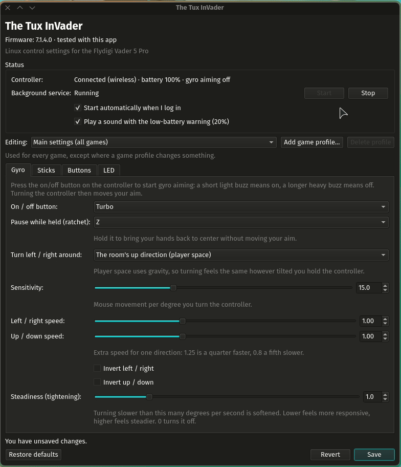

# The Tux InVader



[A short demo of the settings window](https://github.com/user-attachments/assets/3883975e-5936-4cb4-adc9-a7a506bdca1a) (36 s)

Linux control settings for the Flydigi Vader 5 Pro.

A small userspace app for the Flydigi Vader 5 Pro. It gets the back paddles, extra buttons, gyro,
accelerometer and rumble working on Linux, without Flydigi software, kernel modules or driver changes.

## How it works

The controller has a vendor HID interface (`/dev/hidrawN`, usage page `0xFFA0`). After a short
handshake, a "test mode" command makes it stream a complete input report at about 500 Hz. The app
turns test mode on while it runs and switches it off again when it exits.

## Install the AppImage

1. Download the AppImage from [Releases](https://github.com/TJLawInOrbit/tux-invader/releases), make it
   executable (`chmod +x`, or the file's
   Properties → "Allow executing") and open it.
2. In the settings window, click **Set up…**. It copies the app to `~/Applications`, installs the
   permissions rule (asks for your password once), and adds the background service, the app menu entry
   and the tray icon. From a terminal the same is `./The_Tux_InVader-*-x86_64.AppImage setup`.
3. Unplug the controller (or the dongle) and plug it back in, and press the Home button.

It runs on 64-bit PCs with glibc 2.34 or newer (Ubuntu and Pop!_OS 22.04 and later, Debian 12, Fedora,
current Arch-based distros) and systemd. The tray icon needs a desktop with a system tray. On an X11
session Qt also needs `libxcb-cursor0` (Ubuntu and Debian: `sudo apt install libxcb-cursor0`); Wayland
sessions don't.

To update, open the new AppImage and click **Set up…** again. To remove it:
`~/Applications/The_Tux_InVader.AppImage uninstall` (add `--remove-rule` and `--remove-app` to also
remove the permissions rule and the app itself). Your settings in `~/.config/vader5` are kept.

The AppImage has the same commands as `./tux-invader` in the project folder: `settings` (the
default), `tray`, `pad`, `viewer`, `config`, `setup` and `uninstall`; `--help` lists them.

### Build the AppImage

```sh
packaging/build-appimage.sh    # writes dist/The_Tux_InVader-<version>-x86_64.AppImage
```

It needs `curl` and `objdump` (binutils); `rsvg-convert` is used for the icon if it's there. It
downloads a portable Python 3.12, PyQt6, evdev, appimagetool and the AppImage runtime into `build/`,
all pinned to exact versions and checked by SHA-256, and leaves out the parts of Qt the app doesn't use.

To check the newest build on other distros (Ubuntu 22.04 and 24.04, Debian 12, Fedora, Arch) with
Podman, no sudo needed: `packaging/test-distros.sh` (or name one, like `packaging/test-distros.sh debian:12`).

## Run the live viewer

```sh
./vader5-viewer            # full-screen view (needs an 80x24 terminal)
./vader5-viewer --text     # printed lines; add --raw for bytes, --seconds 5 to stop
```

Keys: `r` rumble, `1` strong motor, `2` weak motor, `h` raw bytes, `q` quit.

Quitting normally, Ctrl+C and closing the terminal all switch test mode off. If the app is
force-killed (`kill -9`, a crash), the controller keeps streaming in test mode until it's unplugged
or you run `./vader5-viewer --reset`.

If a button lights up under **Unmapped bits**, it isn't named yet. Note which physical button it
was and add it to `BUTTON_BITS` in `vader5/protocol.py`.

## Use it in games (virtual Xbox Elite controller)

```sh
./vader5-pad            # keep it running while you play; Ctrl+C to stop
./vader5-pad --verbose  # also print button presses and rumble
```

Games and Steam see an Xbox Elite Series 2 controller. The controller's basic Xbox pad is hidden
while this runs, so nothing is pressed twice. Rumble from games is passed to the controller. If you
unplug, switch between cable and dongle, or turn the controller off, it reconnects on its own.

| Vader 5 Pro | Virtual controller |
|-------------|--------------------|
| Sticks, triggers, A B X Y, LB RB, L3 R3, D-pad | Same Xbox buttons and axes |
| Select, Start, Home | Back (View), Start (Menu), Guide |
| M1 / M2 / M3 / M4 | Paddles P1 / P2 / P3 / P4 (as Steam names them) |
| C, Z, LM, RM, FN | Extra buttons 1-5 (bindable in Steam and some games) |
| Turbo | Switches gyro aiming on and off (not sent to games) |

### Gyro aiming

Press **Turbo** to turn gyro aiming on or off. A short light buzz means on; a longer heavy buzz means
off. Prefer to hold a button instead? Set **How to use it** to "Hold it to aim" (`mode = "hold"` under
`[gyro]`) and pick a button that can be held: Turbo only sends a short pulse, so it can't. While it's on, turning the controller left and right moves the mouse sideways, and tilting it
up and down moves it vertically, on top of your normal controller input. Games see an ordinary
mouse ("Vader 5 Pro Keyboard and Mouse"), so it works in any game that lets you aim with the mouse
while you use a controller. Turbo itself isn't sent to games. Gyro aiming starts off each time the controller
connects.

To recenter your hands, set a **ratchet** button (for example `ratchet = "M2"` under `[gyro]`).
While you hold it, gyro aiming pauses, so you can bring the controller back to a comfortable
position without moving your aim, like lifting a mouse off the desk. It isn't sent to games either.
A mouse has no fixed center, so your aim can still slowly shift compared with where the controller
points, for example when the game stops the camera (looking straight up) while you keep turning. The
ratchet is how you correct that.

**Turn around** (`space` under `[gyro]`) chooses how left and right turning is measured:

- `"controller"` (the default): around the controller's own axis. Holding it tilted toward you makes
  turning slower, and turning while tilting shifts your aim.
- `"player"`: around the room's up direction, worked out from gravity ("player space", the usual
  choice in Steam Input and gyro games). Turning feels the same however you hold the controller.

Drift is calibrated out automatically whenever the controller is set down for a moment, for example
on a desk. It only happens while the readings are as steady as a controller that isn't in anyone's
hands, so slow, careful aiming is never mistaken for drift.

The toggle button, sensitivity and direction can be changed in the settings file (see **Settings**).

### Settings

The easiest way is the settings window:

```sh
./vader5-settings
```

To open it from your app menu instead of a terminal, run `./vader5-desktop install` once. It adds
"The Tux InVader" to the app menu and starts the tray icon at login (remove it all with
`./vader5-desktop uninstall`). Opening the app also starts the tray icon if it isn't running yet.

Only one settings window opens at a time: launching it again (from the tray or the app menu) brings
the open window to the front.

At the top it shows the controller's firmware version (see **Firmware**). It also shows whether the
controller is connected and the background service is running (with Start, Stop and "start at login"), and has tabs for the gyro, the sticks, button remaps and the LED strip.
Save applies the changes within about a second. It writes the settings file in its standard layout, so comments
you added to the file by hand aren't kept; the previous file is saved as `config.toml.bak`.

You can also edit the file yourself:

```sh
./vader5-config create   # write a starter settings file with explanations
./vader5-config check    # show mistakes, or the settings in use
./vader5-config path     # where the file is: ~/.config/vader5/config.toml
```

Edit the file and save it: `vader5-pad` applies the change within about a second, with no restart.
If the file has a mistake, `./vader5-config check` and the service log (`./vader5-service logs`) say
what's wrong, and the previous settings stay in use.

- `[gyro]`: toggle button, ratchet (hold to pause) button, turn space, sensitivity, extra speed for left/right
  (`horizontal_scale`) or up/down (`vertical_scale`), inverting either direction, and tightening
  (lower it if small, slow movements feel stiff)
- `[sticks]`: deadzones, for a stick that drifts
- `[pointer]`: hold a button to move the mouse pointer with a stick, and that stick's speed, deadzone
  and curve
- `[remap]`: make a button send something else:
  - another controller button: `M1 = "A"`
  - a keyboard key or combination: `M2 = "key:space"`, `M3 = "key:ctrl+c"`
  - a mouse button: `M4 = "mouse:right"` (`left`, `right`, `middle`, `back`, `forward`)
  - nothing: `RM = "NONE"`

  Key names are like `a`, `1`, `space`, `enter`, `esc`, `tab`, `ctrl`, `shift`, `alt`, `super`,
  `f1` and `f13`; the full list is in `/usr/include/linux/input-event-codes.h`, without `KEY_`.
  Keys are released when you let go of the button, and also if the controller turns off.

### LED strip

The **LED** tab in the settings window (or `[led]` in the settings file) sets what the strip on the
controller shows: the controller's own lights (the default), off, a static color, a color per zone,
breathing, pulse, color cycle, rainbow, strobe, wave, or a flash when you press a button, with
brightness and speed. Game profiles can have their own lights.

`vader5-pad` sends the lights when the controller connects and whenever they change. They are never
saved on the controller, so switching it off and on shows its own lights until the service sends
yours again. The first time the app changes the lights it keeps a copy of the controller's own in
`~/.config/vader5/controller-backups/led-profile<N>-original.bin`, and puts that back when you choose
"Controller's own lights". Effects marked experimental are built from animation frames.

**Flash on button press** is done by the app: the controller's own press-feedback effect only pulses
by itself (with or without test mode), so the strip stays off and `vader5-pad` lights it with the
instant-color command (`5A A5 F5 05 R G B checksum`) the moment a button is pressed, keeps it lit
while held, and switches it off as soon as the button is let go. With up to 4 colors, each press
uses the next one. It only works while the background service is running.

Turn on **Specific buttons** to give chosen buttons their own flash color: pick a button in the list and
click the color box next to it (**No flash** takes it off again). Only those buttons light the strip, and
the colors above aren't used. Holding several, the one pressed last shows. In the settings file:

```toml
[led]
effect = "press_flash"
specific_buttons = true
button_colors = { A = "#00ff00", B = "#ff0000", LB = "#ffaa00" }
```

### A stick as the mouse pointer

Hold a button to move the mouse pointer with a stick, for menus, maps and launchers. Set it up in the
**Sticks** tab: choose the button to hold, which stick points, and the pointer's speed, deadzone and
curve. While you hold the button that stick doesn't reach the game, so nothing moves on screen while
you point. Put a mouse click on another button in the **Buttons** tab to click with it. In the settings
file:

```toml
[pointer]
button = "M3"      # hold this to point; "NONE" = off. Turbo can't be used, it only sends a pulse
stick = "right"
speed = 900.0      # pixels a second at full tilt
deadzone = 0.15
curve = 1.5        # 1.0 moves straight with the stick; higher gives finer control near the center
```

Game profiles can have their own pointer settings, so it can be on for one game and off elsewhere.

### Game profiles

Different settings for different games, switched automatically while the game runs. In the settings
window, click **Add game profile…**, pick one of your installed Steam games (or type the program
name of a non-Steam game), and change the settings you want for that game. Everything you don't
change follows the main settings, so later changes to the main settings still apply to it. The tray
icon, the settings window and the service log show which profile is in use.

Steam games are recognized by the Steam app ID that Steam gives every game it starts (Proton games
included); other games by their program name, as shown in System Monitor. If two games with
profiles run at once, the one started most recently wins. In the settings file a profile looks like:

```toml
[[profile]]
name = "Street Fighter 6"
steam_app_id = 1364780      # or: process = "game.exe"
[profile.gyro]
sensitivity = 20.0
[profile.remap]
M1 = "M1"                   # M1 sends itself in this game, whatever [remap] says
```

### Tray icon

`./vader5-tray` puts a controller icon in the system tray; after `./vader5-desktop install` it also
starts at login, and opening the settings window starts it too. The icon is in color while the controller is on and grey while it's off or the
background service isn't running. Hover over it for connection, battery and gyro status, click it
to open the settings, and right-click for a menu (status, open settings, start or stop the
background service, quit). When the battery drops to 20% or less and isn't charging, it shows one
warning ("Controller battery at 20%") with the desktop's battery sound, and warns again only after the
battery has been charged. Turn the sound off with "Play a sound with the low-battery warning" in the
settings window, or `low_battery_sound = false` under `[notifications]` in the settings file. The battery level comes from the
controller in 20% steps.

The tray and settings window read a small status file that `vader5-pad` keeps up to date
(`$XDG_RUNTIME_DIR/vader5/status.json`), so they never talk to the controller directly.

### Start automatically

```sh
./vader5-service install    # run now and every time you log in (a systemd user service, no root)
./vader5-service off        # stop until next login; the basic Xbox pad comes back
./vader5-service on         # start again
./vader5-service status     # is it running? latest messages
./vader5-service logs       # follow messages live
./vader5-service restart    # after updating the code
./vader5-service uninstall  # remove the service
```

The virtual controller appears when the controller starts sending input and disappears about
3 seconds after it stops (switched off, asleep or unplugged), so Steam never lists a controller
that's off. Only one `vader5-pad` can run at a time: while the service is on, `./vader5-pad` in a
terminal will tell you it's already running. `./vader5-viewer` still works alongside it, but input
in games pauses for about half a second when the viewer quits.

### Seeing only one controller

With the udev rule from **Permissions** installed, `vader5-pad` takes the kernel's basic Xbox driver
off the controller while it runs, so Steam and games list only the Xbox Elite controller. When
`vader5-pad` stops, the basic pad comes back. If `vader5-pad` was force-killed, run
`./vader5-viewer --reset` or replug the controller.

Without the rule, the basic pad is only silenced: it sends nothing, but Steam and SDL games still
list it. For a Steam game you can hide it from the game with this launch option:
`SDL_GAMECONTROLLER_IGNORE_DEVICES=0x37d7/0x2401 %command%`

### Firmware

The app was built and tested with controller firmware **7.1.4.0**. The settings window and the service
log show the connected controller's firmware and say when it's a version the app hasn't been tested
with. Updating the firmware with Flydigi's software can't be undone from Linux, and may change things:

- From 7.1.4.1, SDL (used by many games, and maybe Steam) has its own driver for this controller, so it
  may take over the controller while this app runs: a second controller shows up, or input cuts out.
- Buttons, gyro or LED data could move. `./vader5-viewer` shows what the controller sends.

Real reports from a 7.1.4.0 controller, over the cable and over the dongle (every button, full stick
and trigger travel, resting and moving gyro, the factory LED data), are kept in `tests/data`, and
`tests/test_firmware_7140.py` checks them. Support for other firmware is added alongside, so 7.1.4.0 controllers keep working.

The app's commands (`vader5-pad`, `vader5-settings`, ...), its settings folder (`~/.config/vader5`)
and its virtual devices keep their original names, so existing setups keep working.

## Requirements

- From the project folder: Python 3.10+, python-evdev, and PyQt6 for the settings window and tray icon
  (the AppImage bundles all of these)
- Read/write access to the controller's hidraw node. Steam's `60-steam-input.rules` already grants
  this for Flydigi devices to the logged-in user.

### Permissions

`vader5/data/70-vader5-pro.rules` gives the logged-in user access to this controller's hidraw
interface (inputs, rumble, test mode) and its USB device, which lets `vader5-pad` remove the basic
Xbox pad while it runs, and to `/dev/uinput`, which it needs to create the virtual controller, keyboard
and mouse. Steam's own udev rules grant the same kind of access. `setup` installs the rule for you;
by hand:

```sh
sudo install -m 644 vader5/data/70-vader5-pro.rules /etc/udev/rules.d/
sudo udevadm control --reload-rules
```

Then unplug and replug the controller (or the dongle). To undo:

```sh
sudo rm /etc/udev/rules.d/70-vader5-pro.rules
sudo udevadm control --reload-rules
```

### What it can reach

- **Runs as you, never as root.** The only step that needs root is installing the permissions rule
  above: `setup` asks once through your desktop's password prompt (`pkexec`), and hands the rule's text
  straight to that command rather than leaving a file for anything else to swap first.
- **Talks to no network.** Nothing in the app opens a network connection, phones home or collects
  anything. The only socket it uses is a local one in your runtime folder, so a second launch can bring
  the open settings window to the front. (The build and distro-test scripts do download pinned files,
  but they aren't part of what you run.)
- **The permissions rule is as narrow as the job allows.** The controller's hidraw node and USB device
  are matched by this controller's vendor and product ID, and only the person logged in at the screen
  gets access. `/dev/uinput` is the exception: it can't be narrowed, and it lets programs you run create
  virtual keyboards and mice. Steam's own rules grant the same; if you'd rather not, Steam's rules may
  already cover uinput on your system and you can drop that line from the rule.
- **Writes only to your own files:** `~/.config/vader5` (settings), `~/.local/share` (menu entry and
  icon), `~/Applications` (the AppImage copy) and `~/.config/systemd/user` (the service). `uninstall`
  removes them; your settings stay unless you delete them.
- **Nothing is written to the controller's memory.** The lights are sent live, and the controller's own
  stored profiles are left alone.
- **Your settings file is yours.** It's read with Python's TOML parser and every value is checked;
  a bad file is reported and the previous settings stay in use. Nothing in it runs commands: the worst a
  strange file can do is remap your buttons oddly.

## Tests

```sh
python3 -m unittest discover tests
```

## Layout

| File | Purpose |
|------|---------|
| `vader5/protocol.py` | Command packets and report decoding (no I/O) |
| `vader5/device.py` | Finds the controller, handshake, test mode on/off, rumble |
| `vader5/viewer.py` | Live viewer (curses and text mode) |
| `vader5/virtual_pad.py` | Virtual Xbox Elite controller (uinput): button mapping, rumble requests |
| `vader5/gyro.py` | Gyro aiming: toggle, drift calibration |
| `vader5/keyboard_mouse.py` | Virtual keyboard and mouse (uinput): gyro movement, keys for remapped buttons |
| `vader5/config.py`, `vader5-config` | Settings file: loading, checking, writing, reloading on save |
| `vader5/settings_window.py`, `vader5-settings` | Settings window (PyQt6) |
| `vader5/tray.py`, `vader5-tray` | Tray icon: status, battery warning (PyQt6) |
| `vader5/status.py` | Status file shared by the service, tray and settings window |
| `vader5/games.py` | Finds installed Steam games and which profile's game is running |
| `vader5/led.py` | LED strip effects: builds the controller's LED data |
| `vader5/launch.py`, `tux-invader` | One command for every part of the app (the AppImage runs this) |
| `vader5/install.py` | Setup and uninstall: permissions rule, background service, app menu, tray at login |
| `vader5/data/` | The permissions rule and the app icon |
| `packaging/` | AppImage build script, launcher and desktop entry |
| `vader5-desktop` | Adds the app menu entry and starts the tray icon at login |
| `vader5/pad.py` | Runs the virtual controller: hides the basic pad, forwards rumble, reconnects |
| `vader5-service` | Installs and controls `vader5-pad` as a systemd user service |

## Protocol notes

Commands are 32 bytes: `5A A5 <cmd> <args...> <checksum>`, where the checksum is the sum of every
byte after `5A A5`.

| Command | Bytes |
|---------|-------|
| Handshake | `5A A5 01 02 03`, `5A A5 A1 02 A3`, `5A A5 02 02 04`, `5A A5 04 02 06` |
| Test mode on / off | `5A A5 11 07 FF 01 FF FF FF 15` / `... 00 FF FF FF 14` |
| Rumble | `5A A5 12 06 <strong> <weak> 00 00 <checksum>` |
| Active profile | `5A A5 A1 02 A3` (reply byte 5) |
| LED read / write | `A7` (profile, 20) / `A8` (profile, 0, packets, 20) + `A9` (index, 20 bytes) — never saved with `A6` |
| LED instant color | `5A A5 F5 05 R G B <checksum>` (shown at once, not saved; the next LED write replaces it) |

LED data (layout from [flydigi-vader-pro-5-ctl](https://github.com/rR6kULhc5xgS/flydigi-vader-pro-5-ctl)'s
protocol notes, checked on this controller): a 20-byte header (version 3.0, click-feedback flag,
animation first/last frame, period, brightness 0-100, 10 zones, effect) and 10 frames of 10 RGB colors.

Input report (`5A A5 EF`, 32 bytes):

| Offset | Content |
|--------|---------|
| 3-10 | Left X, left Y, right X, right Y (int16 LE) |
| 11 | D-pad up `01`, right `02`, down `04`, left `08`; A `10`, B `20`, Select `40`, X `80` |
| 12 | Y `01`, Start `02`, LB `04`, RB `08`, LT pressed `10`, RT pressed `20`, L3 `40`, R3 `80` |
| 13 | C `01`, Z `02`, M1 `04`, M2 `08`, M3 `10`, M4 `20`, LM `40`, RM `80` |
| 14 | FN `01`, Turbo `02` (a ~50 ms pulse per press, however long it's held), Home `08` |
| 15, 16 | LT, RT (0-255) |
| 17-22 | Gyro X, Y, Z (int16 LE, ±32768 = ±2000 °/s) |
| 23-28 | Accel X, Y, Z (int16 LE, 4096 = 1 g) |
| 29 | Packet counter over the dongle (0 over the cable) |
| 30 | Unused so far |
| 31 | Checksum: sum of bytes 2-30 |

Sources: SDL's `SDL_hidapi_flydigi.c`, [BANANASJIM/flydigi-vader5](https://github.com/BANANASJIM/flydigi-vader5),
and captures from a real controller (firmware 7.1.4.0).

## Roadmap

Done:

1. Live viewer (tested over the cable and the 2.4G dongle)
2. Virtual Xbox Elite controller: back paddles, extra buttons, rumble, basic Xbox pad hidden (v0.1)
3. Starts automatically at login as a systemd user service, and reconnects on its own
4. Gyro aiming as a mouse: toggle button, ratchet (hold to pause), left/right and up/down speed
5. Settings file and settings window; keyboard keys and mouse buttons in remaps
6. Tray icon with a low-battery warning, app menu entry and per-game profiles (v0.2)
7. LED strip control, including a flash on button press, per button if you like (v0.3)
8. AppImage with a one-click setup, tested on Ubuntu, Debian, Fedora and Arch (v0.4)
9. Gyro aiming while a button is held, and a stick as the mouse pointer (v0.5.0)

Next:

- Gyro: less slip between where the controller points and where you aim
- Support for newer controller firmware, once someone runs it (see **Firmware**)

Not planned: gyro for emulators.

## License

Copyright (C) 2026 tjlaw

The Tux InVader is free software: you can use it, study it, change it and share it under the terms of
the **GNU General Public License, version 3 or later** (see `LICENSE`). If you share a changed version,
share its source under the same license. It comes with no warranty.

### What the AppImage bundles

The AppImage carries these unchanged, each under its own license. `packaging/build-appimage.sh` pins
every version and checks its SHA-256, so anyone can rebuild the same file from this repository.

| Bundled | Version | License | Source |
|---------|---------|---------|--------|
| Python | 3.12.14 (as a [python-appimage](https://github.com/niess/python-appimage) build) | PSF | [python.org/downloads](https://www.python.org/downloads/release/python-31214/) |
| PyQt6 | 6.11.0 (with PyQt6-sip 13.12.0) | GPL v3 | [pypi.org/project/PyQt6](https://pypi.org/project/PyQt6/6.11.0/#files) |
| Qt | 6.11.2 (as PyQt6-Qt6, trimmed to the parts used) | LGPL v3 | [download.qt.io](https://download.qt.io/archive/qt/6.11/6.11.2/single/) |
| python-evdev | 2.0.0 (as evdev-binary) | Revised BSD | [pypi.org/project/evdev](https://pypi.org/project/evdev/2.0.0/#files) |
| AppImage runtime | [type2-runtime 20251108](https://github.com/AppImage/type2-runtime/releases/tag/20251108) | MIT | that release page |

PyQt6 is GPL v3, which is why this app is too.

## Credits

The controller's protocol was worked out from these projects and checked against a real Vader 5 Pro:

- [flydigi-vader-pro-5-ctl](https://github.com/rR6kULhc5xgS/flydigi-vader-pro-5-ctl) — protocol notes for
  the LED and mapping data, and the settings commands
- [BANANASJIM/flydigi-vader5](https://github.com/BANANASJIM/flydigi-vader5) — the vendor "test mode" that
  streams the paddles, gyro and accelerometer
- [SDL](https://github.com/libsdl-org/SDL)'s `SDL_hidapi_flydigi.c` — the input report layout and how the
  battery is reported

Flydigi and Vader are trademarks of their owner; this project isn't connected with Flydigi.
